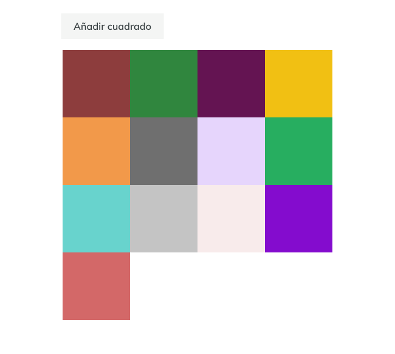

# Ejercicio 7

Crea una malla de cuadrados de tal forma que el color de cada uno de ellos se determine de forma aleatoria y vaya cambiando cada segundo.

Añade también un botón que permita añadir un nuevo cuadrado a la maya con las mismas propiedades que los anteriores.
